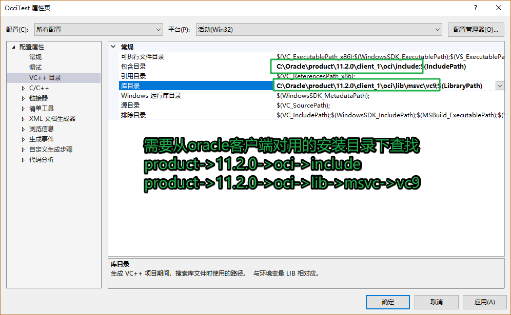
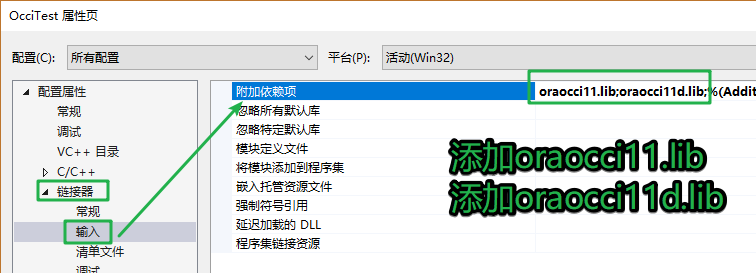

## 1. OCCI

> Oracle C++调用接口 -- OCCI 即 Oracle C++ Call Interface
>
> OCCI 是Oracle 的C++ API, 允许你使用面向对象的特性、本地类、C++语言的方法来访问Oracle数据库   

### 1.1 OCCI 介绍

1. 优势

   > 1. 基于标准C++和面向对象的设计；
   > 2. 效率较高；
   > 3. 适合开发C/S模式的程序，软件中间层；

2. 特性

   > 1. 完整支持SQL/PLSQL
   > 2. 为不断增长的用户和请求提供了弹性选项
   > 3. 为使用用户自定义类型，如C中的类，提供了无缝接口
   > 4. 支持所有的Oracle数据类型以及LOB types（大对象）
   > 5. 可以访问数据库元数据

3. OCCI 头文件

   ```c++
   #include <occi.h>   -- 程序中只需要包含这一个头文件
   #include <occiCommon.h>
   #include <occiControl.h>
   #include <occiData.h>
   #include <occiObjects.h>
   ```

4. OCCI 库

   - Windows

     - oraocci11.lib/ oraocci11d.lib
     - oraocci11.dll/ oraocci11d.dll
   - Linux
     - libnnz11.so 
     - libocci.so
     - libclntsh.so


### 1.2 OCCI使用

#### 1.2.1 初始化 - Environment 类

> OCCI通过创建一个Environment的对象完成初始化工作。
>
> 可以通过Environment创建数据库连接，从而进行其它的操作
>
> 要创建Environment，应该调用Environment类的静态方法**createEnvironment()**

```c++
// 环境初始化
Environment* env = Environment::createEnvironment();
// 关闭, 释放资源
Environment::terminateEnvironment(env);
```

#### 1.2.2 连接数据库 - Connection 类

> 连接数据库通过Connection类的对象实例实现
>
> 调用Environment类的**createConnection()**方法可以创建一个Connection对象；

```c++
// 函数原型: 
Connection *Environment::createConnection( 
    const string &userName,const string &password, const string &connectString );
```

```c++
// 函数调用
const string userName = "scott";	// 用户名
const string passwd = "tiger";	// 密码
const string connstr = "192.168.247.129:1521/orcl";	// 数据库连接串
Connection* conn = env->createConnection(userName, passwd, connstr);
```

> 使用**Environment::terminateConnection()**断开连接

```c++
// 断开连接
env->terminateConnection(conn);
```

#### 1.2.3 执行SQL

> Statement 类用于执行SQL语句,并获取返回结果。
>
> ResultSet 类用于处理SELECT 查询的结果。
>
> 对于所有类型的数据的绑定或者获取，OCCI都提供了统一的方法
>
> - setXXX  方法用于Statement
> - getXXX 方法用于Statement & ResultSet
>
> OCCI会自动处理类型之间的转换。
>
> 使用方法：
>
> 使用Connection::**createStatement()**创建Statement对象, 指定 SQL 命令(DDL/DML/query)作为参数

```c++
// 操作函数
Connection::createStatement(string &sql);

Statement::setSQL(string &sql);

Statement::execute(string &sql); 	  // can be used for any SQL, returns status

Statement::executeUpdate(string &sql); // returns Insert/Update/Delete count

Statement::executeQuery(string &sql);  // returns ResultSet（结果集）
```

> 使用 setXXX 方法传递要绑定用于输入的值
>
> 使用合适的execute方法执行SQL
>
> 对于SELECT 查询, 使用ResultSet 对象处理返回结果

```c++
// 插入操作
Statement *stmt = conn->createStatement(“ insert into Dept(Deptno,Dname, Loc) values (1, ‘ACCOUNTS’, ‘ZONE1’ ”);
stmt->executeUpdate();  
conn->terminateStatement(stmt);       // 关闭查询, 释放资源
```

> 使用绑定参数的DML（数据操作语句）示例：

 ```c++
Statement *stmt = conn->createStatement(“ insert into  Emp(EmpNo,Ename) values(:1, :2) ”);  
//1 and 2 are bind placeholders  
int empno = 2;  
string empname = “JOHN W”;  
//first parameter is bind position, second is value  
stmt->setInt(1, empno);   
stmt->setString(2, empname);  
stmt->executeUpdate();  
 ```

> 执行SELECT查询并处理结果： 

```c++

Statement *stmt = conn->createStatement(
    “select Empno, Ename, Sal from Emp where Hiredate >= :1”);  
  
//automatically converted to Date  
stmt->setString(1, “01-JAN-1987”);  
  
//executeQuery returns a ResultSet  
ResultSet *rs = stmt->executeQuery();   
  
//ResultSet::next fetches rows and returns FALSE   
//when no more rows  
while (rs->next() == true)  
{  
   //get values using the getXXX methods of ResultSet  
   empno = rs->getInt(1);  
   empname = rs->getString(2);  
   empsalary = rs->getFloat(3);  
}  
stmt->closeResultSet(rs);//to free resources 
```

### 1.3 window配置occi环境





## 2. 守护进程

1. 守护进程特点

   > - 后台服务进程
   > - 独立于控制终端
   > - 周期性执行某任务
   > - 不受用户登录注销影响
   > - 一般采用以d结尾的名字(服务)
   > 

2. 创建守护进程的流程 

   - **创建子进程, 杀死父进程** - 必须的

     - 创建子进程: fork();
     - 守护进程是怎么来的?
       - 有一个没有任何职务的进程才可以被加官进爵, 守护进程是一个会话
         - 范围: 进程 -> 进程组 -> 会话
           - 进程组中的组长: 默认是进程组中的第一个进程
     - 如何杀死父进程
       - exit(0)
       - kill()
       - raise() -> 自己给自己发信号
       - abort() -> 给自己发送SIGABRT信号

   - **子进程提升为会话**  - 必须的

     - setsid()
     - 提升成功之后, 进程就脱离了终端

   - 修改工作目录 - 可选

     - chdir();
     - /mnt/U盘1/app
       - 在当前目录/mnt/U盘1/下 执行 ./app, 进程的工作路径:   /mnt/U盘1/
     - 将工作目录切换到一个不能被卸载的路径下就可以了
       - chdir("/home");

   - 修改掩码 - 可选

     - umask();

   - 关闭/重定向文件描述法 - 可选

     - 标准输入 -> 0

     - 标准输出 -> 1

     - 标准错误 -> 2

     - 如果的重定向, 对应的位置: /dev/null

       - 重定向的目的: 排除干扰

         ```c
         int devFd = open("/dev/null", O_RDWR);
         int dup2(int oldfd, int newfd);
         dup2(devFd, 0);
         newfd 不管之前指向哪一个文件, 现在指向oldfd
         ```

   - **核心处理动作 -> 周期性的执行某些操作** - 必须

   - 关闭守护进程 -> 使用shell脚本管理 - 可选

## 3. 编写脚本

###3.1 shlle脚本介绍

1. 什么是shell脚本?

   - shell命令的集合, 可以使用控制语句: for , if ..else, while(), 这些命令写到一个文件中, 给这个文件一个可执行权限

2. 基本格式?
   - 命名

     - 一般文件后缀为.sh - 推荐使用
       - xxx.sh
     - 这个.sh后缀并不是必须要加的
       - xxx

   - 书写格式 

     - 第一行, 解析脚本命令的时候使用的命令解析器

       ```shell
       #! /bin/bash
       shell 命令 * n
       
       /bin/sh - shell
       /bin/bash - 
       ```

     - shell脚本的中命令的执行顺序

       - 逐行解析

   - 添加权限

     ```shell
     chmod u+x xxx.sh
     ```

3. 执行脚本

   - ./xxx.sh     -  用的比较多
   - sh xxx.sh

### 3.2 shell中的变量

1. 如何定义变量

   ```shell
   // c/c++
   int number;
   int num = 100;
   // shell, 变量没有数据类型, 必须给定义的变量初始化
   value1="hello"
   value2=111
   value3='world'
   注意事项: 在赋值的时候, 等号前后不能有空格
   ```

2. 位置变量 - 执行shell脚本时候, 传递到内部的参数

   - $1

   - $2

   - $3

   - $....

     ```shell
     #! /bin/bash
     echo "$0" $0
     echo "参数1" $1
     echo "参数2" $2
     echo "参数3" $3
     echo "参数4" $4
     
     # 执行脚本
     ./aa.sh aa bb cc dd ee ff gg
     # 结果
     ./aa.sh ./aa.sh
     参数1 aa
     参数2 bb
     参数3 cc
     参数4 dd
     ```

3. 特殊变量
   - $#:  执行脚本时候传递的参数的个数
   - $@: 执行脚本时候, 传递的所有参数
   - $$: 进程PID
   - $?: 程序执行完成之后的返回值

4. 取普通变量的值 

   - 普通变量名前边加上$
     - $var
     - ${var}

5. 取命令执行之后的得到的值

   - 语法1: var=$(shell命令) 
     - $()
   - 语法2: var= \`shell命令`
     - 反单引号  \``

### 3.3 awk介绍

> awk 可以将文件拆分成功若干行, 根据指定的分隔符, 再将每一行拆分成若干列, 默认按照空格或tab进行拆分

1. 基本语法格式

   ```shell
   § awk 参数  '条件{处理动作}' 操作的文件或数据
   	□ awk '$1 > 1000{num++; print num}
   § awk 参数  '/正则表达式{处理动作}' 操作的文件或数据
   
    ps aux | awk '$2 > 60000{print $2}'
   ```

2. 指定分隔符的参数: -F

   - -F分隔符
     - -F:

3. 如何使用变量取出某一列? 

   - $0 - 代表当前行
   - $1 - 第一列
   - $2 - 第二列
   - $3 .....

### 3.4 条件判断语法

```shell
if [ -d aa ]; then
	处理动作
elif [ -f aa ]; then
	处理动作
	处理动作
else
	处理动作
	处理动作
fi
```

```shell
if [ -d aa ]
then
	处理动作
elif [ -f aa ]
then
	处理动作
	处理动作
else
	处理动作
	处理动作
fi
```

### 3.5 关闭对应进程的shell脚本

```shell
# 得到当前用户的用户名
USER=$(whoami)
# 获取当前进程的PID
PID=`ps -u $USER | grep SecKeyServer.ou | awk '{print $1}'`
if [ -z $PID ]; then
	# pid为空
	echo "pid为空"
else
	# 非空字符串
	# 给对应的进程发信号
	kill -10 $PID
fi
```


## 知识点回顾

### 1. Linux如何查找动态库(编译、运行) ?

1. 编译和链接时，动态库的搜索路径顺序如下（注意不会递归性地在其子目录下搜索）：

   ```c
   (1) gcc编译、链接命令中的-L选项；
   (2) gcc的环境变量的 LIBRARY_PATH（多个路径用冒号分割）；
   (3) gcc默认动态库目录：/lib:/usr/lib:usr/lib64:/usr/local/lib。
   ```

2. 运行时，动态库的搜索路径顺序如下：

   ```c
   (1) 编译目标代码时指定的动态库搜索路径：用选项-Wl,rpath和include指定的动态库的搜索路径，
       比如gcc -Wl,-rpath,include -L. -ldltest hello.c，在执行文件时会搜索路径`./include`；
   (2) 环境变量LD_LIBRARY_PATH（多个路径用冒号分割）；
   (3) 修改 /etc/ld.so.conf 配置文件指定的动态库绝对路径, /etc/ld.so.cache
      （通过sudo ldconfig生效，一般是非root用户时使用）；
   (4) gcc默认动态库目录：/lib:/usr/lib:usr/lib64:/usr/local/lib 等。
   ```


### 2. oracle解锁用户

```sql
// 解锁用户
ALTER USER scott ACCOUNT UNLOCK;
// 重写设置密码
ALTER USER scott IDENTIFIED BY tiger; 
```


### 3. shell条件测试参考

1. 文件状态测试

    | -b filename       | 当filename 存在并且是块文件时返回真(返回0)                   |
    | ----------------- | ------------------------------------------------------------ |
    | -c filename       | 当filename 存在并且是字符文件时返回真                        |
    | -d pathname       | 当pathname 存在并且是一个目录时返回真                        |
    | -e pathname       | 当由pathname 指定的文件或目录存在时返回真                    |
    | -f filename       | 当filename 存在并且是正规(普通)文件时返回真                  |
    | -g pathname       | 当由pathname   指定的文件或目录存在并且设置了SGID 位时返回真 |
    | -h/-L   filename  | 当filename 存在并且是符号链接文件时返回真 (或  filename)     |
    | -k pathname       | 当由pathname   指定的文件或目录存在并且设置了"粘滞"位时返回真 |
    | -p filename       | 当filename 存在并且是命名管道时返回真                        |
    | -r pathname       | 当由pathname 指定的文件或目录存在并且可读时返回真            |
    | -s filename       | 当filename 存在并且文件大小大于0 时返回真                    |
    | -S filename       | 当filename 存在并且是socket 时返回真                         |
    | -t fd             | 当fd   是与终端设备相关联的文件描述符时返回真                |
    | -u pathname       | 当由pathname   指定的文件或目录存在并且设置了SUID 位时返回真 |
    | -w pathname       | 当由pathname 指定的文件或目录存在并且可写时返回真            |
    | -x pathname       | 当由pathname 指定的文件或目录存在并且可执行时返回真          |
    | -O pathname       | 当由pathname   存在并且被当前进程的有效用户id 的用户拥有时返回真(字母O 大写) |
    | -G pathname       | 当由pathname   存在并且属于当前进程的有效用户id 的用户的用户组时返回真 |
    | file1 -nt   file2 | file1   比file2 新时返回真                                   |
    | file1 -ot   file2 | file1   比file2 旧时返回真                                   |
    | f1 -ef f2         | files f1   and f2 are hard links to the same file            |

2. 常见字符串测试 

   | -z string      | 字符串string   为空串(长度为0)时返回真         |
   | -------------- | ---------------------------------------------- |
   | -n string      | 字符串string   为非空串时返回真                |
   | str1 =   str2  | 字符串str1   和字符串str2 相等时返回真         |
   | str1 ==   str2 | 同 =                                           |
   | str1 !=   str2 | 字符串str1   和字符串str2 不相等时返回真       |
   | str1 <   str2  | 按字典顺序排序，字符串str1 在字符串str2 之前   |
   | str1 >   str2  | 按字典顺序排序，字符串str1   在字符串str2 之后 |

3. 常见数值测试

   | nt1 -eq   int2  | 如果int1   等于int2，则返回真     |
   | --------------- | --------------------------------- |
   | int1 -ne   int2 | 如果int1   不等于int2，则返回真   |
   | int1 -lt   int2 | 如果int1   小于int2，则返回真     |
   | int1 -le   int2 | 如果int1   小于等于int2，则返回真 |
   | int1 -gt   int2 | 如果int1   大于int2，则返回真     |
   | int1 -ge   int2 | 如果int1   大于等于int2，则返回真 |

4. 测试时使用的逻辑操作符

   | -a   | 逻辑与，操作符两边均为真，结果为真，否则为假。   |
   | ---- | ------------------------------------------------ |
   | -o   | 逻辑或，操作符两边一边为真，结果为真，否则为假。 |
   | !    | 逻辑否，条件为假，结果为真。                     |