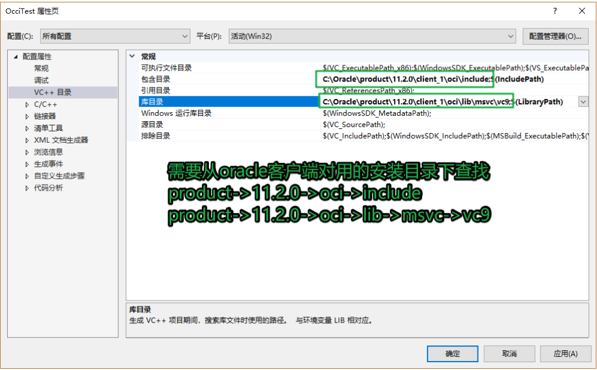
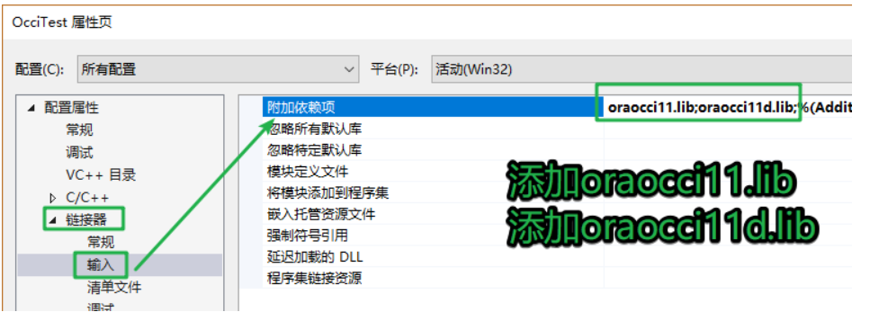
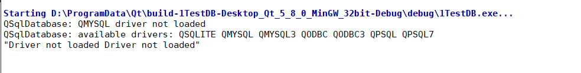

##00. 目录
[TOC]

## 01. OCCI概述

**1.1 OCCI介绍**

>Oracle C++调用接口 -- OCCI 即 Oracle C++ Call Interface
>
>OCCI 是Oracle 的C++ API, 允许你使用面向对象的特性、本地类、C++语言的方法来访问Oracle数据库  

**1.2 OCCI优势**

> 1) 基于标准C++和面向对象的设计；
>
> 2) 效率较高；
>
> 3) 适合开发C/S模式的程序，软件中间层；

**1.3 特性**

> - 完整支持SQL/PLSQL
> - 为不断增长的用户和请求提供了弹性选项
> - 为使用用户自定义类型，如C++中的类，提供了无缝接口
> - 支持所有的Oracle数据类型以及LOB types（大对象）
> - 可以访问数据库元数据


**1.4 相关头文件**

```C++
#include <occi.h>   -- 程序中只需要包含这一个头文件
#include <occiCommon.h>
#include <occiControl.h>
#include <occiData.h>
#include <occiObjects.h>
```

**1.5 OCCI库**

- Windows平台
  - oraocci11.lib/ oraocci11d.lib
  - oraocci11.dll/ oraocci11d.dll
- Linux平台
  - libnnz11.so 
  - libocci.so
  - libclntsh.so


## 02. OCCI使用

**2.1 初始化 - Environment 类**

>OCCI通过创建一个Environment的对象完成初始化工作。
>
>可以通过Environment创建数据库连接，从而进行其它的操作
>
>要创建Environment，应该调用Environment类的静态方法**createEnvironment()**

```C++
// 环境初始化
Environment* env = Environment::createEnvironment();
// 关闭, 释放资源
Environment::terminateEnvironment(env);
```

**2.2 连接数据库 - Connection 类**

>连接数据库通过Connection类的对象实例实现
>
>调用Environment类的**createConnection()**方法可以创建一个Connection对象；

函数原型:

```C++
// 函数原型: 
Connection *Environment::createConnection( 
    const string &userName,const string &password, const string &connectString );
```

代码片段:

```C++
// 函数调用
const string userName = "scott";	// 用户名
const string passwd = "tiger";	// 密码
const string connstr = "192.168.247.129:1521/orcl";	// 数据库连接串
Connection* conn = env->createConnection(userName, passwd, connstr);
```

使用**Environment::terminateConnection()**断开连接

```C++
// 断开连接
env->terminateConnection(conn);
```


连接Oracle数据库示例

```C++
#include <iostream>
#include <occi.h>

using namespace std;
using namespace oracle::occi;  //命令空间

int main(void)
{
	string name = "scott";
	string passwd = "11";
	string connectStr = "192.168.11.53:1521/orcl";

	//1. 创建OCCI的环境
	Environment *env = Environment::createEnvironment();
	if (NULL == env)
	{
		cout << "createEnvironment failed...." << endl;
		return 1;
	}

	//2. 连接数据库
	Connection *connect = env->createConnection(name, passwd, connectStr);
	if (NULL == connect)
	{
		cout << "CreateConnection failed..." << endl;
		return 1;
	}
	cout << "连接oracle服务端ok ..." << endl;


	//关闭连接
	env->terminateConnection(connect);

	//终止环境
	Environment::terminateEnvironment(env);


	cout << "hello world" << endl;

	return 0;
}
```


**2.3 执行SQL语句**

>Statement 类用于执行SQL语句,并获取返回结果。
>
>ResultSet 类用于处理SELECT 查询的结果。
>
>对于所有类型的数据的绑定或者获取，OCCI都提供了统一的方法
>
>- setXXX  方法用于Statement
>
>- getXXX 方法用于Statement & ResultSet
>
>- OCCI会自动处理类型之间的转换。
>
>  使用方法：
>
>  使用Connection::**createStatement()**创建Statement对象, 指定 SQL 命令(DDL/DML/query)作为参数

代码片段

```c++
// 操作函数
Connection::createStatement(string &sql);

Statement::setSQL(string &sql);

Statement::execute(string &sql); 	  // can be used for any SQL, returns status

Statement::executeUpdate(string &sql); // returns Insert/Update/Delete count

Statement::executeQuery(string &sql);  // returns ResultSet（结果集）
```


>使用 setXXX 方法传递要绑定用于输入的值
>
>使用合适的execute方法执行SQL
>
>对于SELECT 查询, 使用ResultSet 对象处理返回结果

```C++
// 插入操作
Statement *stmt = conn->createStatement(“ insert into Dept(Deptno,Dname, Loc) values (1, ‘ACCOUNTS’, ‘ZONE1’ ”);
stmt->executeUpdate();  
conn->terminateStatement(stmt);       // 关闭查询, 释放资源
```

> 使用绑定参数的DML（数据操作语句）示例：

```C++
Statement *stmt = conn->createStatement(“ insert into  Emp(EmpNo,Ename) values(:1, :2) ”);  
//1 and 2 are bind placeholders  
int empno = 2;  
string empname = “JOHN W”;  
//first parameter is bind position, second is value  
stmt->setInt(1, empno);   
stmt->setString(2, empname);  
stmt->executeUpdate();  
```

> 执行SELECT查询并处理结果： 

```C++
Statement *stmt = conn->createStatement(
    “select Empno, Ename, Sal from Emp where Hiredate >= :1”);  
  
//automatically converted to Date  
stmt->setString(1, “01-JAN-1987”);  
  
//executeQuery returns a ResultSet  
ResultSet *rs = stmt->executeQuery();   
  
//ResultSet::next fetches rows and returns FALSE   
//when no more rows  
while (rs->next() == true)  
{  
   //get values using the getXXX methods of ResultSet  
   empno = rs->getInt(1);  
   empname = rs->getString(2);  
   empsalary = rs->getFloat(3);  
}  
stmt->closeResultSet(rs);//to free resources 
```


## 03. VS2017配置OCCI环境







测试代码

```C++
#include <iostream>
#include <occi.h>
#include <string>
using namespace std;
using namespace oracle::occi;

int main()
{
	// 1. 初始化连接环境
	Environment* env = Environment::createEnvironment();
	// 2. 创建连接
	string userName = "scott";
	string passwd = "tiger";
	string connstr = "192.168.247.129:1521/orcl";
	// conn是建立连接之后得到的对象
	Connection* conn = env->createConnection(userName, passwd, connstr);
	if (conn == NULL)
	{
		cout << "连接失败..." << endl;
		return -1;
	}
	cout << "数据库连接成功..." << endl;

	// 3. 创建一个用户操作sql的对象
	// key给这个函数指定sql语句也可以不指定
	Statement* stat = conn->createStatement();
	// 如果没有指定执行的sql可以通过set方法指定
	string sql = "select dname, loc from dept";
	// stat->setSQL(sql);
	// 执行sql语句
	ResultSet* resSet = stat->executeQuery(sql);
	// 取出所有的记录
	while (resSet->next())
	{
		// 每循环一次读一条记录
		// 读出这条记录的三个字段
		int no = resSet->getInt(1);	// 1 - 第一个字段
		string str1 = resSet->getString(2);
		string str2 = resSet->getString(3);
	}
	conn->terminateStatement(stat);
	env->terminateConnection(conn);
	// 释放资源
	Environment::terminateEnvironment(env);

	return 0;
}
```


## 04. OCCI中事务处理

```C++
#include <iostream>
#include <occi.h>
#include <string>
using namespace std;
using namespace oracle::occi;

int main()
{
	// 1. 初始化连接环境
	Environment* env = Environment::createEnvironment();
	// 2. 创建连接
	string userName = "scott";
	string passwd = "tiger";
	string connstr = "192.168.247.129:1521/orcl";
	// conn是建立连接之后得到的对象
	Connection* conn = env->createConnection(userName, passwd, connstr);
	if (conn == NULL)
	{
		cout << "连接失败..." << endl;
		return -1;
	}
	cout << "数据库连接成功..." << endl;

	// 3. 创建一个用户操作sql的对象
	// key给这个函数指定sql语句也可以不指定
	Statement* stat = conn->createStatement();
	// 如果没有指定执行的sql可以通过set方法指定
	string sql = "select * from dept";
	// stat->setSQL(sql);
	// 执行sql语句
	ResultSet* resSet = stat->executeQuery(sql);
	// 取出所有的记录
	while (resSet->next())
	{
		// 每循环一次读一条记录
		// 读出这条记录的三个字段
		int no = resSet->getInt(1);	// 1 - 第一个字段
		string str1 = resSet->getString(2);
		string str2 = resSet->getString(3);
		cout << "no: " << no << endl;
		cout << "name" << str1 << endl;
		cout << "loc" << str2 << endl;
	}
	// 关闭结果集
	stat->closeResultSet(resSet);

	// 插入语句
	// 设置sql语句
	// occi dml 会自动打开一个事务
	sql = "insert into dept values(:1, :2, :3)";
	stat->setSQL(sql);
	stat->setInt(1, 66);
	stat->setString(2, "itcast");
	stat->setString(3, "china");
	// 执行sql语句
#if 0
	int ret = stat->executeUpdate();
	if (ret == 0)
	{
		cout << "insert fail..." << endl;
		// 失败状态回滚
		conn->rollback();
		return -1;
	}
	conn->commit();
#else
	// 设置事务的自动处理
	stat->setAutoCommit(true);
	int ret = stat->executeUpdate();
	if (ret == 0)
	{
		cout << "insert fail..." << endl;
		// 失败状态回滚
		return -1;
	}
#endif


	conn->terminateStatement(stat);
	env->terminateConnection(conn);
	// 释放资源
	Environment::terminateEnvironment(env);

	return 0;
}
```


## 05. Linux平台下OCCI环境搭建

相关文件:oracle_client_11gR2.tar.gz

解压文件:

> [root@deng test1]# tar -xzvf oracle_client_11gR2.tar.gz 

将解压之后的文件 剪切到opt目录中

> [root@deng test1]# mv instantclient_11_2 /opt/

设置环境变量

> [test1@deng ~]$ vim ~/.bash_profile 
>
> 文件最后添加

```shell
# 请把已经环境变量设置到对应的文件中
# 可以是当前用户的 ~/.bashrc文件, 也可以是系统的 /etc/profile文件

# OCCI_HOME 该环境变量的路径需要做对应修改
export OCCI_HOME=/opt/instantclient_11_2 
export OCCI_INCLUDE_DIR=$OCCI_HOME/sdk/include
export OCCI_LIBRARY_PATH=$OCCI_HOME 
export LD_LIBRARY_PATH=$LD_LIBRARY_PATH:$OCCI_LIBRARY_PATH
# 程序编译是搜索的库目录
export LIBRARY_PATH=$LIBRARY_PATH:$OCCI_LIBRARY_PATH
# 程序编译时搜索的头文件目录
export CPLUS_INCLUDE_PATH=$CPLUS_INCLUDE_PATH:$OCCI_INCLUDE_DIR
export NLS_LANG="SIMPLIFIED CHINESE_CHINA.ZHS16GBK"
```


使生效

> [test1@deng ~]$ source  ~/.bash_profile  


编译测试程序

```C++
// DBTest.cpp: 定义控制台应用程序的入口点。
//
#include <iostream>
#include <occi.h>
using namespace std;
using namespace oracle::occi;

int main()
{
	const string userName = "SCOTT";
	const string password = "11";
	const string connString = "192.168.11.53:1521/orcl";
	try
	{
		Environment *env = Environment::createEnvironment(Environment::DEFAULT);
		Connection *con = env->createConnection(userName, password, connString);
		cout << "Success to connect!" << endl;
		Statement *stmt = con->createStatement();
		stmt->setSQL("select * from dept");
		ResultSet *rs = stmt->executeQuery();
		while (rs->next())
		{
			cout << "ID:" << rs->getInt(1) << endl;
		}
		con->terminateStatement(stmt);
		env->terminateConnection(con);
		Environment::terminateEnvironment(env);
	}
	catch (SQLException &ex)
	{
		cout << ex.what() << endl;
	}

//	system("pause");
	return 0;
}
```

> [test1@deng instantclient_11_2]$ g++ DBTest.cpp -lnnz11 -lclntsh -locci 

执行结果:

>[test1@deng instantclient_11_2]$ ./a.out  
>Success to connect!
>ID:3
>ID:1
>ID:2
>ID:10
>ID:20
>ID:30
>ID:40
>[test1@deng instantclient_11_2]$


##06. Qt中数据库的使用

1. QSqlDatabase类

   ```c++
   // 静态函数, 添加一个数据库实例
   QSqlDatabase addDatabase(const QString &type, const QString &connectionName = QLatin1String( defaultConnection ))
       - type: 要操作的数据的驱动的名字
       - connectionName: 数据库连接名
   QSqlDatabase addDatabase(QSqlDriver *driver, const QString &connectionName = QLatin1String( defaultConnection ))
   // 通过连接名得到数据库实例对象 
   QSqlDatabase database(const QString &connectionName = QLatin1String( defaultConnection ), bool open = true)
       - connectionName: 通过这个连接名得到对应的数据库实例对象
       - open: 得到数据库实例的状态, true为打开
       - 返回值: 数据库实例对象
       
   // 公共成员函数
   // 设置数据库名字
   void setDatabaseName(const QString &name)
   // 设置数据库服务器地址
   void setHostName(const QString &host)
   // 设置数据库登录密码
   void setPassword(const QString &password)
   // 设置数据库端口, 如果数据端口是默认值, 可以不在程序中设置   
   void setPort(int port)
   // 设置用户名
   void setUserName(const QString &name)
   // 打开数据库
   bool open()
           
   // 事务相关的操作
   bool QSqlDatabase::transaction();
   // 提交操作
   bool QSqlDatabase::commit()	
   // 操作回滚
   bool QSqlDatabase::rollback()
   ```

2. QSqlQuery - 数据库查询类

   ```c++
   // 构造函数
   QSqlQuery(const QString &query = QString(), QSqlDatabase db = QSqlDatabase())
       - query: 要执行的sql语句
       - db: 使用查询类操作的数据实例
   QSqlQuery(QSqlDatabase db)
   	- db: 使用查询类操作的数据实例
   // 添加并执行sql语句
   bool exec(const QString &query)
   bool exec()
   // 遍历查询到的结果集
   // 调用一次next就得到结果集中的一条记录
   bool next()
   // 从记录中将字段取出
   QVariant value(int index) const
   	- index: 字段的编号, 从0开始
   QVariant value(const QString &name) const
   	- name: 字段的名字
   ```


## 06. Qt连接MySQL数据库的步骤

```C++
   //1. 创建一个数据库对象
    QSqlDatabase db = QSqlDatabase::addDatabase("QMYSQL");

    //2. 设置主机名字
    db.setHostName("192.168.11.53");

    //3. 设置用户名
    db.setUserName("root");

    //4. 设置密码
    db.setPassword("123456");

    //5. 设置端口
    db.setPort(3306);

    //6. 设置使用的数据库
    db.setDatabaseName("test");

    //7. 打开数据库
    bool ret = db.open();
    if (ret)
    {
        qDebug() << "打开数据库ok...";
    }
    else
    {
        qDebug() << db.lastError().text();
    }

    //8. 关闭数据库连接
    db.close();
```


## 07. Qt连接MySQL数据库问题解决

**问题分析**



**原因**

MYSQL数据库驱动没有加载

**解决办法:**

找到Qt安装目录,  

> H:\other\Qt5.8\5.8\mingw53_32\bin

将动态库libmysql.dll拷贝到H:\other\Qt5.8\5.8\mingw53_32\bin(自己的安装目录)